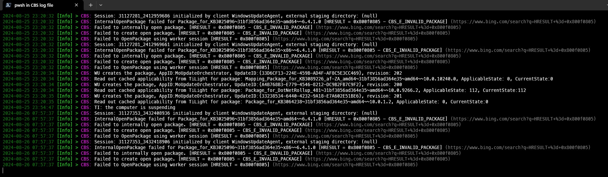
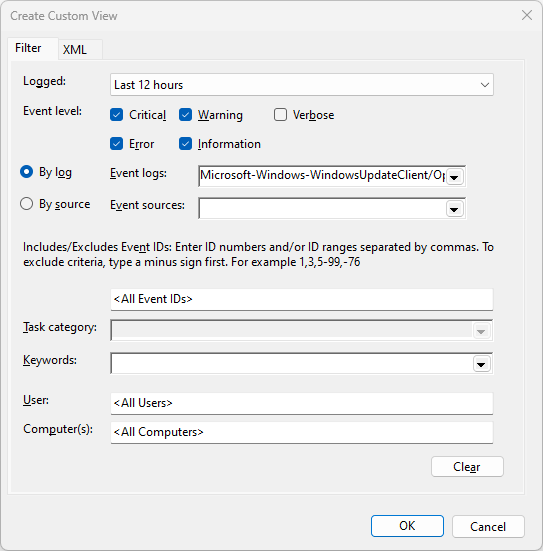
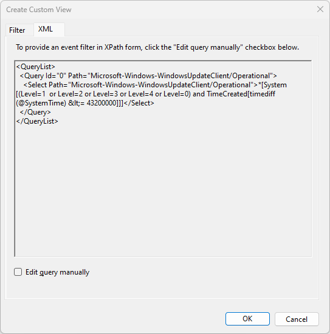

# PowerShell Log File Monitoring

This repository contains my PowerShell scripts for log file monitoring. These scripts demonstrate my development skills and are intended to showcase my abilities for employment opportunities.

Feel free to explore and provide feedback.

*More to come...*

## CBS log file
I was experiencing extremely slow download and the errors in Windows Update. I found the errors in the log file:

```
2024-08-24 14:09:32, Error CBS Failed to load Session:31126970_1091286069 [HRESULT = 0x80070002 - ERROR_FILE_NOT_FOUND]
```

After researching Microsoft Support, and running Terminal as an Administrator, I used:

```
sfc /scannow
DISM /Online /Cleanup-Image /ScanHealth
DISM /Online /Cleanup-Image /CheckHealth
DISM /Online /Cleanup-Image /RestoreHealth
```

I tried updating again, this fixed the issues.

> ***Note:*** I tried this, and is not simply a recommendation. If you are unsure, check online.

Example:


## Windows Update Log XML Filter.

This script outputs any events recorded in Windows Events, highlighting different log levels with colors.

Using Windows Event Viewer to create custom view, then copied XML, modified as required:



I have years of experience with XML - So I decided to use the `Get-WinEvent -FilterXML` parameter.
```XML
$xmlQuery = @"
<QueryList>
  <Query Id="0" Path="Microsoft-Windows-WindowsUpdateClient/Operational">
    <Select Path="Microsoft-Windows-WindowsUpdateClient/Operational">*[System[($LevelsQuery) 
        and TimeCreated[timediff(@SystemTime) &lt;=$MilliSeconds]]]</Select>
  </Query>
</QueryList>
"@
```